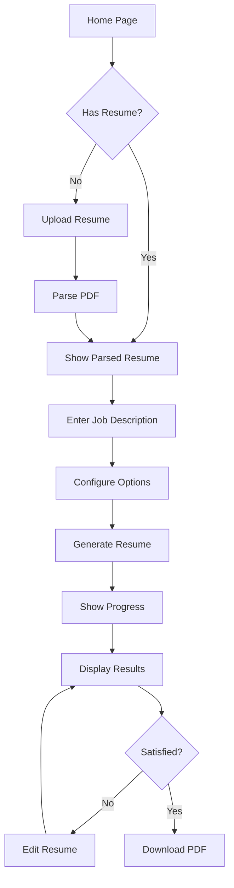

# Streamlit-Only Migration Plan

## Overview

Migrate all functionality from the React frontend to a single Streamlit application. This eliminates:
- CORS issues
- REST API complexity
- Multiple deployments
- WebSocket limitations
- Authentication complexity

## Current React Features to Migrate

### 1. Authentication (Auth0)
**Current:** Auth0 login with JWT tokens
**Streamlit:** Simplified password protection or remove authentication entirely

| Feature | React | Streamlit Alternative |
|---------|-------|----------------------|
| Login page | Auth0 | `st.text_input` with password |
| Protected routes | Route guards | `st.session_state` checks |
| User session | JWT tokens | `st.session_state` |

**Recommendation:** For personal/portfolio use, skip authentication. For multi-user, use Streamlit's password protection or Google OAuth.

### 2. Upload Step
**Current:** Drag-and-drop PDF upload with validation
**Streamlit:** `st.file_uploader` with PDF validation

```python
# Streamlit equivalent
uploaded_file = st.file_uploader(
    "Upload your resume PDF",
    type=["pdf"],
    help="Upload a PDF resume to parse and process"
)
```

### 3. Job Description Step
**Current:** Text area for job description, configuration options
**Streamlit:** `st.text_area` + `st.slider` + `st.select_slider`

```python
# Streamlit equivalent
job_description = st.text_area(
    "Job Description",
    height=200,
    placeholder="Paste the job description here..."
)
target_ats = st.slider("Target ATS Score", 70, 100, 92)
max_pages = st.select_slider("Max Pages", [1, 2], value=1)
```

### 4. Progress Step
**Current:** Animated progress bar with status updates
**Streamlit:** `st.progress` + `st.status` + `st.spinner`

```python
# Streamlit equivalent
with st.status("Generating resume...", expanded=True) as status:
    st.write("Parsing resume...")
    # ... parsing logic
    st.write("Analyzing job description...")
    # ... analysis logic
    st.write("Generating tailored content...")
    # ... generation logic
    status.update(label="Complete!", state="complete")
```

### 5. Editor Page
**Current:** View/edit resume sections, download PDF, check ATS score
**Streamlit:** `st.expander` for sections + `st.download_button`

```python
# Streamlit equivalent
with st.expander("👤 Personal Information", expanded=True):
    name = st.text_input("Name", resume_data['basics']['name'])
    email = st.text_input("Email", resume_data['basics']['email'])
    # ...

# Download button
st.download_button(
    "📥 Download Resume PDF",
    data=pdf_bytes,
    file_name="tailored_resume.pdf",
    mime="application/pdf"
)
```

## New Streamlit App Structure

```
streamlit_app/
├── app.py                    # Main Streamlit application
├── requirements.txt          # Python dependencies
├── .streamlit/
│   └── config.toml          # Streamlit configuration
├── backend/                  # Backend modules (copied)
│   ├── __init__.py
│   └── app/
│       ├── __init__.py
│       ├── models.py
│       ├── resume.py
│       └── ai_client.py
├── intelligence/             # AI modules (copied)
│   ├── __init__.py
│   ├── ats_scorer.py
│   ├── content_generator.py
│   └── role_detector.py
└── vision/                   # PDF validation (copied)
    ├── __init__.py
    └── pdf_validator.py
```

## App Flow (Mermaid Diagram)



## Implementation Steps

### Step 1: Create Main App Structure
- Single-page app with session state management
- Step-based flow using `st.session_state['step']`

### Step 2: Implement Upload Section
- PDF file uploader
- PDF validation
- Resume parsing with AI

### Step 3: Implement Job Description Section
- Text area for job description
- Configuration sliders
- Generate button with progress

### Step 4: Implement Results Section
- Display tailored resume
- Edit functionality
- ATS score display
- PDF download

### Step 5: Polish UI
- Custom CSS for modern look
- Responsive layout
- Error handling

## Streamlit Cloud Deployment

### Requirements
```
streamlit>=1.40.0
fpdf2
pypdf
pdfplumber
Pillow
google-generativeai
pydantic>=2.0.0
python-dotenv
requests
beautifulsoup4
httpx
aiohttp
jinja2
tenacity
```

### Secrets Configuration
In Streamlit Cloud dashboard:
```toml
NVIDIA_API_KEY = "your-api-key"
```

### Main File Path
```
streamlit_app/app.py
```

## Advantages of Streamlit-Only Approach

| Aspect | React + Backend | Streamlit Only |
|--------|-----------------|----------------|
| Deployment | 2 platforms | 1 platform |
| CORS | Complex | None |
| Authentication | Auth0 setup | Optional |
| API endpoints | REST API needed | Direct function calls |
| WebSocket | Required for progress | Built-in progress |
| Maintenance | 2 codebases | 1 codebase |
| Cost | 2 free tiers | 1 free tier |

## Timeline

1. **Phase 1:** Basic app structure and upload functionality
2. **Phase 2:** Job description and generation
3. **Phase 3:** Results display and editing
4. **Phase 4:** PDF download and polish
5. **Phase 5:** Deploy to Streamlit Cloud

## Questions to Decide

1. **Authentication:** Keep it simple (no auth) or add password protection?
2. **Styling:** Use default Streamlit styling or custom CSS?
3. **Multi-page:** Single page with sections or multi-page app?
