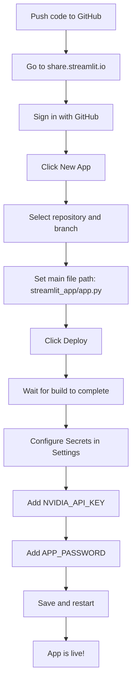

# ResumeMaker Streamlit App - Setup Guide

## Overview

The Streamlit app (`streamlit_app/`) is a standalone AI-powered resume builder that allows you to:
- Upload and parse PDF resumes
- Generate resumes tailored for specific job descriptions
- Get ATS compatibility scores
- Download ATS-optimized PDFs

## Prerequisites

Before starting, ensure you have:
- Python 3.9+ installed
- An NVIDIA API key (for AI features)

## Quick Setup

### Step 1: Navigate to Streamlit App Directory

```bash
cd streamlit_app
```

### Step 2: Create Virtual Environment

```bash
# Create virtual environment
python -m venv venv

# Activate virtual environment
# On macOS/Linux:
source venv/bin/activate

# On Windows:
venv\Scripts\activate
```

### Step 3: Install Dependencies

```bash
pip install -r requirements.txt
```

### Step 4: Configure Environment Variables

Create a `.env` file in the `streamlit_app/` directory:

```bash
cp .env.example .env
```

Edit the `.env` file with your credentials:

```env
# NVIDIA API Key - Required for AI features
NVIDIA_API_KEY = "your-nvidia-api-key-here"

# App Password - For login protection
APP_PASSWORD = "your-password-here"
```

#### Getting an NVIDIA API Key

1. Go to [NVIDIA Developer](https://developer.nvidia.com/)
2. Sign up or log in
3. Navigate to NVIDIA NGC (NVIDIA GPU Cloud)
4. Generate an API key from your account settings

### Step 5: Run the Application

```bash
streamlit run app.py
```

The app will be available at `http://localhost:8501`

## Project Structure

```
streamlit_app/
├── app.py                    # Main Streamlit application
├── requirements.txt          # Python dependencies
├── .env.example             # Environment variables template
├── .env                     # Your local environment variables (create this)
├── .streamlit/
│   └── config.toml          # Streamlit configuration
├── backend/                  # Backend modules
│   └── app/
│       ├── models.py        # Data models
│       ├── resume.py        # Resume handling
│       └── ai_client.py     # AI API client
├── intelligence/             # AI modules
│   ├── ats_scorer.py        # ATS scoring logic
│   ├── content_generator.py # Content generation
│   └── role_detector.py     # Job role detection
├── vision/                   # PDF validation
│   └── pdf_validator.py
└── utils/                    # Utility functions
    ├── cache_manager.py
    ├── queue_manager.py
    └── rate_limiter.py
```

## Configuration Options

### Streamlit Configuration

The `.streamlit/config.toml` file contains UI settings. You can customize:
- Theme colors
- Server port
- Browser settings

### Environment Variables

| Variable | Description | Required |
|----------|-------------|----------|
| `NVIDIA_API_KEY` | NVIDIA API key for AI features | Yes |
| `APP_PASSWORD` | Password for app access | Yes (production) |

**Note:** For local development with `STREAMLIT_ENV=development`, the default password is `dev-password`.

## Deployment to Streamlit Cloud (Step-by-Step)

### Prerequisites for Deployment

- GitHub account
- Your code pushed to a GitHub repository
- NVIDIA API key

### Step 1: Push Code to GitHub

If you haven't already:

```bash
# Initialize git if needed
git init

# Add all files
git add .

# Commit changes
git commit -m "Initial commit - ResumeMaker Streamlit app"

# Add your GitHub repository as remote
git remote add origin https://github.com/YOUR_USERNAME/YOUR_REPO.git

# Push to GitHub
git push -u origin main
```

### Step 2: Create Streamlit Cloud Account

1. Go to [share.streamlit.io](https://share.streamlit.io)
2. Click **Sign in with GitHub**
3. Authorize Streamlit to access your GitHub repositories

### Step 3: Create New App

1. In the Streamlit Cloud dashboard, click **New app** button
2. You'll see a form to configure your app

### Step 4: Configure App Settings

Fill in the following:

| Field | Value |
|-------|-------|
| **Repository** | Select your ResumeMaker repository from dropdown |
| **Branch** | `main` (or your default branch name) |
| **Main file path** | `streamlit_app/app.py` |
| **App URL** (optional) | Choose a custom subdomain like `yourname-resumemaker` |

Click **Deploy!** button

### Step 5: Wait for Deployment

- Streamlit will start building your app
- This typically takes 2-5 minutes for the first deployment
- You can watch the build logs in real-time

### Step 6: Configure Secrets (IMPORTANT)

Once deployed, you need to add your API keys:

1. In your app dashboard, click **Settings** (gear icon)
2. Click **Secrets** in the left sidebar
3. Add the following secrets in TOML format:

```toml
NVIDIA_API_KEY = "your-actual-nvidia-api-key-here"
APP_PASSWORD = "your-secure-password-here"
```

4. Click **Save**
5. The app will automatically restart with the new secrets

### Step 7: Access Your App

Your app will be available at:
- `https://your-app-name.streamlit.app`

### Step 8: Test Your Deployment

1. Open your app URL
2. Enter the password you set in secrets
3. Upload a test resume
4. Try generating a tailored resume

### Deployment Diagram



### Updating Your Deployment

When you push new changes to GitHub:

```bash
git add .
git commit -m "Update app"
git push
```

Streamlit Cloud will automatically redeploy your app.

### Common Deployment Issues

#### Issue: Module Not Found Error

**Solution:** Ensure all dependencies are in `streamlit_app/requirements.txt`

#### Issue: App Won't Start

**Solution:** Check the logs in Streamlit Cloud dashboard for specific errors

#### Issue: Secrets Not Working

**Solution:** 
- Verify TOML format (no trailing commas, proper quotes)
- Ensure secret names match exactly what the app expects

---

## Alternative Deployment: Render (Free Tier)

1. Push code to GitHub
2. Go to [dashboard.render.com](https://dashboard.render.com)
3. Create new Web Service
4. Connect your repository
5. Configure:
   - Runtime: Docker
   - Branch: main
   - Plan: Free
6. Add environment variables
7. Deploy

## Troubleshooting

### Import Errors

If you see import errors:
```bash
# Ensure you're in the streamlit_app directory
cd streamlit_app

# Verify all modules exist
ls -la backend/ intelligence/ vision/ utils/

# Reinstall dependencies
pip install -r requirements.txt
```

### API Key Issues

If AI features don't work:
1. Verify `NVIDIA_API_KEY` is set in `.env`
2. Check the key is valid at NVIDIA Developer portal
3. Check Streamlit logs for errors

### PDF Generation Issues

If PDF generation fails:
1. Ensure `fpdf2` is installed: `pip install fpdf2`
2. Check that resume data is valid
3. Try regenerating the resume

### Port Already in Use

If port 8501 is in use:
```bash
# Run on a different port
streamlit run app.py --server.port 8502
```

## Usage

1. **Login** - Enter the app password
2. **Upload Resume** - Upload your existing resume PDF
3. **Generate** - Paste job description and generate tailored resume
4. **Edit** - Review and modify the generated content
5. **Download** - Download the ATS-optimized PDF

## Next Steps

After successful setup:
1. Test with a sample resume
2. Try different job descriptions
3. Explore ATS scoring features
4. Customize the UI theme if desired
